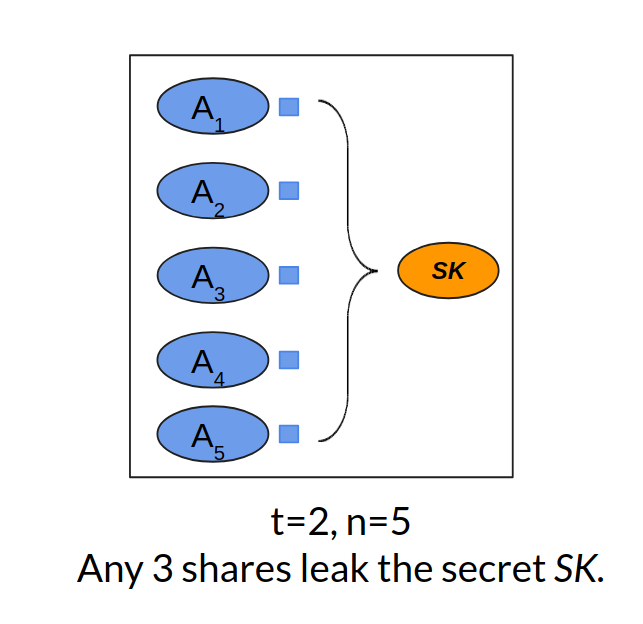
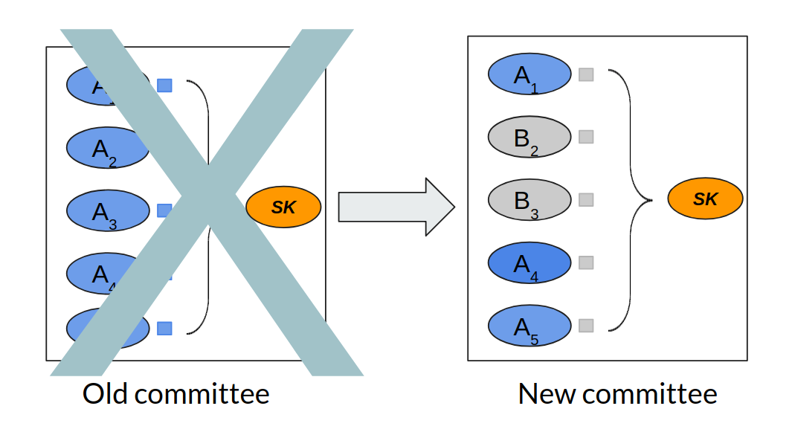

====================================
Decentralize Your Secrets with CHURP
====================================

:author: Deepak Maram and Fan Zhang and Ari Juels
:time: 09:30
:updated: 2019-03-12T09:30
:summary: Achieving true decentralization requires decentralized cryptography. CHURP is a cryptographic protocol for secret sharing in decentralized settings. In such a setting where nodes may come and go, traditional secret sharing (e.g., Shamir's) is no longer secure. Featuring several fundamental innovations, CHURP accomplishes the mission while being 2300x more efficient than previous schemes!
:tags: secret sharing, key loss, decentralization

At the heart of decentralized systems today is a demoralizing irony. Vast resources---intellect, equipment, and energy---go into avoiding centralized control and creating "trustless" systems like Bitcoin.
But hapless users then defeat the whole purpose of these systems by handing over their private keys to **centralized** entities like Coinbase. Or worse still, they lose their keys, sending about **$14 billion** in Bitcoin into a black hole (according to an `estimate <http://fortune.com/2017/11/25/lost-bitcoins/>`__ made two years ago).

But who can blame them? Even experts find key management hard. That's why, decades after its invention, public-key cryptography is rarely used for things as simple as e-mail encryption.

It's also why the hapless users of cryptocurrency in question aren't "they." They're also "we." Even at IC3, some of us shamefacedly use Coinbase instead of managing our own keys.

Wouldn't it be nice if *true decentralization* were within the grasp of ordinary users, if there were a system that: (1) made user key management easier and (2) was itself actually decentralized? And, even better, if it could: (3) manage keys for entities that can't store secrets, such as smart contracts?

These are the goals of `CHURP <http://www.churp.io>`__ (CHUrn-Robust Proactivization), a new system we've developed at IC3 and presented in a paper `here <https://eprint.iacr.org/2019/017.pdf>`__. CHURP is an `open-source <https://github.com/CHURPTeam/CHURP>`__ project already on the current product roadmap of `Oasis Labs <https://www.oasislabs.com/>`__, and we hope to see it used in many other places.

Committees: Here today, gone tomorrow
-------------------------------------

Decentralized key management, like single-user key management, is easy in principle. A *committee* of *n* nodes can hold a private key *SK* that is distributed using `(t,n)-secret sharing <https://en.wikipedia.org/wiki/Shamir%27s_Secret_Sharing>`__.
An adversary must then corrupt *t+1* nodes in order to steal *SK*. This creates a strong obstacle to compromise.

Any *t+1* nodes can act in concert to access *SK*, ensuring high uptime. In fact, by means of *threshold cryptography*, nodes can perform operations with *SK* using individual shares, never explicitly reassembling and exposing *SK*.
The figure below shows a (2,5)-secret sharing. Each of the five nodes (A1, A2, ..., A5) has a share (the small blue square) of the secret (the orange oval). Any three nodes can jointly compute the secret. The idea is similar to *multisig* addresses in cryptocurrency.

   An example of (2, 5)-Shamir secret sharing.

A number of decentralized systems, e.g., Enigma, Calypso and Coconut make use of such key management via committees. It's a compelling option, but there are some lurking problems.

The first problem is the risk of *mobile adversaries*. It may be hard for an adversary to compromise *t+1* nodes in a short space of time.
If a static set of nodes stores *SK* indefinitely, though, an adversary can attack nodes *gradually*, ultimately corrupting the *t+1* it needs to learn *SK*.

The classical countermeasure to mobile adversaries, devised in the 1990s, is known as *proactivization*. Nodes periodically *refresh* their shares, i.e., perform a fresh secret-sharing of *SK*. If proactivization happens on, say, a daily basis, then the shares that an adversary compromised yesterday no longer count today. In our (2,5)-secret sharing example, if the adversary compromised 2 shares yesterday and 2 today, despite having 4 shares, she can't reassemble *SK*. Yesterday's shares aren't compatible with today's.
Proactivization forces an adversary not just to compromise *t* nodes, but to do so quickly, before a refresh happens.

There's a second big problem, though---particularly in decentralized systems. *Nodes may enter and leave the system.* Thus the set of nodes in a committee may change over time, i.e., they're subject to *churn*.

Churn is a problem that existing secret-sharing schemes, even proactive ones---simply don't solve.

Churn is a Challenge
--------------------

In order to understand why committee churn is not an easy problem, let's consider a naive strategy for handling it.

   Handoff between two committees.

The figure above shows two committees---equal-sized old and new committees. Due to churn, some nodes in the old committee leave (A2 and A3), while new nodes replace them (B2 and B3).
For the purpose of this example, assume that both the committees use (2,5)-secret sharing for some secret *SK*. (2,5)-secret sharing is meant to protect against compromise of two nodes.
So let's assume that a mobile adversary can control two nodes in *each of the old and new committees.*

A naive strategy might directly transfer shares between the old nodes and the corresponding new ones that replace them.
In particular, in the above example, node A2 could give its share to node B2 before leaving, while node A3 could give its share to node B3. But this quickly falls apart in the face of a mobile adversary.
This adversary could corrupt nodes A1 and A2 in the old committee and B2 and B3 in the new committee. Thus the adversary learns a new share through node B3.
The adversary thus learns 3 shares in total. Since we're using a (2,5)-secret sharing, she thus learns *SK*, breaking the system. [1]_

CHURP
-----

In a nutshell, CHURP is a proactive secret-sharing system that solves the above problem, and handles committee churn securely. It's not the first system to do this, but it's the first practical one.

The key innovation in CHURP is something called *dimension-switching*. Suppose, in our example above, it were somehow possible to switch temporarily from a (2,5)-sharing of *SK* to a (4,5)-sharing during the handoff from the old committee to a new one. Then, despite being able to learn 3 shares, the adversary would not learn *SK*.

Dimension-switching essentially "dilutes" the secret shares thus preventing leakage despite the adversary learning more during the handoff.
CHURP uses bivariate polynomials (two dimensional polynomials) to share the secret.
Switching from (2,5)-sharing to (4,5)-sharing can be achieved by switching between the two dimensions of the bivariate polynomial.
For more details of our construction, please refer to the `full paper <https://eprint.iacr.org/2019/017.pdf>`__.

Another key innovation in CHURP is a tiered protocol that achieves high performance and strong robustness simultaneously. By default, CHURP uses an *optimistic* path.
It assumes that *all* nodes execute the specified protocol correctly. In this case CHURP is highly efficient.
If any node cheats (e.g., it sends malformed messages), however, CHURP can efficiently detect the fact and then switch to an alternative, *pessimistic* execution path.
In this case, the protocol runs slower but is resilient to cheating players.
The optimistic path in CHURP is especially communication-efficient.
The best known protocol prior to CHURP [`Schultz07 <http://www.pmg.lcs.mit.edu/papers/a34-schultz.pdf>`__] incurs 5GB of network bandwidth for a 100-node committee.
By comparison, CHURP (optimistic path) incurs only 2MB---a **2300x** improvement! In fact, even the pessimistic path of CHURP performs better than any previously known protocol.

CHURP has some other bells and whistles. For example, it uses a trusted setup phase, as required by a special commitment scheme [`Kate10 <https://www.iacr.org/archive/asiacrypt2010/6477178/6477178.pdf>`__] that helps keep communication costs low.
But if this trusted setup fails, CHURP still remains secure.
The innovation here is a *hedge*---an additional verification step that detects compromised trusted setup and switches to a secondary
pessimistic path that avoids the vulnerable commitment scheme, at the cost of some additional slowdown.

Despite the technical intricacy, using CHURP in your project is easy. At a high level, CHURP provides a concise API that enables periodic committee rotation without changing the secret. We strongly encourage you to checkout the code_ and play with the demo.

Lots of Applications
--------------------

Blockchain systems, by nature, cannot store private data. The ability of CHURP to store and manage private keys through *dynamic* committees enables interesting applications without introducing centralization.
Below, we briefly enumerate a few of the most important potential applications of CHURP.

1) *Cryptocurrency Management:* Rather than relying on centralized exchanges to store private keys on behalf of users, or using hardware or software wallets,
which are notoriously `difficult <https://www.inc.com/yazin-akkawi/bitcoins-biggest-challenge-boils-down-to-two-letters-ux.html>`__ to manage, users could instead store their private keys with committees.
These committees could authenticate users and enforce access-control, resulting in the decentralized equivalent of today's exchanges.

2) *Decentralized Identity:* Initiatives such as the `Decentralized Identity Foundation <https://identity.foundation/>`__, which is backed by a number of major IT and services firms,
envision an ecosystem in which users control their identities and data by means of private keys.
Who will store these keys and how is an `open question <https://medium.com/uport/the-basics-of-decentralized-identity-d1ff01f15df1>`__. The same techniques used for private key management would similarly apply to assets such as identities.

3) *Smart-contract attestations:* CHURP could augment smart contracts with confidential state, allowing them to, e.g., produce attestations regarding blockchain state change.
Such signing would be of particular benefit in creating a simple smart-contract interface with *off-chain* systems.
For example, control of Internet-of-Things (IoT) devices is a commonly proposed application of smart contracts
(`smart locks <https://bitcoinmagazine.com/articles/slock-it-to-introduce-smart-locks-linked-to-smart-ethereum-contracts-decentralize-the-sharing-economy-1446746719/>`__ being a notable early example).
If smart contracts cannot generate digital signatures, then the devices they control must monitor a blockchain, a resource intensive operation `infeasible <https://blog.slock.it/slock-it-iot-layer-f305601df963>`__ for IoT devices.
A smart contract that can generate a digital signature, however, can simply issue authenticable commands to target devices.

If you are interested in learning more about CHURP, please check out our website_, code_, or even the paper_.
We are excited to hear about any challenging use-cases for CHURP you might have!

.. [1]  There are other issues with this naive strategy such as the assumption of equal sized committees and that all nodes stay alive till the new replacing nodes join. We don't make any such assumptions in the actual protocol.

.. _website: http://churp.io
.. _code: https://github.com/CHURPTeam/CHURP
.. _paper: https://eprint.iacr.org/2019/017.pdf
